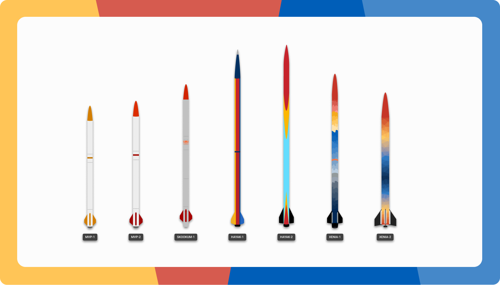

# Ground-Support

    

Ground Support is a telemetry visualization and post flight analysis tool developed by the University of Victoria Rocketry Team. It is designed to be a modular and dynamic application that can be used for any configuration of sounding rocket.

    

# Contents

All documentation can be found in the `documentation` folder.

## [1. Installation Guide](documentation/installation.md#developer-installation)

**[1.1 Developer Installation](documentation/installation.md#developer-installation)**

**[1.2 Non-technical Installation](documentation/installation.md#non-technical-installation)**

## [2. Overview](documentation/overview.md#project-motivation)
### [2.1 Project Motivation](documentation/overview.md#project-motivation)
### [2.2 Project Description](documentation/overview.md#project-description)

## [3. Developer Guide](documentation/developer-guide.md)

### [3.1 Resources](documentation/developer-guide.md#resources)
### [3.2 Standards](documentation/developer-guide.md#standards)

**[3.2.1 Code Style](documentation/developer-guide.md#code-style)**

### [3.3 Frontend Development](documentation/developer-guide.md#frontend-development)

### [3.4 Backend Development](documentation/developer-guide.md#backend-development)

### [3.5 Telemetry](documentation/developer-guide.md#telemetry-backend)
## [4. API Documentation](documentation/api.md#api-documentation)

### [4.1 Client API wrapper](documentation/api.md#client-side-api-docs)

**[4.1.1 Typescript support](documentation/api.md#type-security)**

**[4.1.2 Error Handling](documentation/api.md#error-handling-and-logging)**

**[4.1.2 Endpoints](documentation/api.md#endpoints)**

## [5. Frontend Documentation](documentation/client.md#client-documentation)

### [5.1 Design Patterns](documentation/client.md#design-patterns)

**[5.1.1 Dynamic UI](documentation/client.md#dynamic-ui)**

**[5.1.2 MUI](documentation/client.md#mui)**

**[5.1.3 TypeScript](documentation/client.md#typescript)**

**[5.1.4 Styling](documentation/client.md#styling)**

### [5.2 Views](documentation/client.md#views)

### [5.3 Components](documentation/client.md#components)

### [5.4 Component Life Cycle](documentation/client.md#component-life-cycle)

## [6. Backend Documentation](documentation/server.md#backend-documentation)

### [6.1 Architecture](documentation/server.md#architecture)

### [6.2 Hosting](documentation/server.md#hosting)

### [6.3 Design Patters](documentation/server.md#design-patterns)

**[6.3.1 Micro Services](documentation/server.md#micro-service-architecture)**

**[6.3.2 Entity Based Design](documentation/server.md#entity-based-design)**

### [6.4 Server](documentation/server.md#server-backend)

**[6.4.1 Entities](documentation/server.md#entities)**

**[6.4.2 Data Constructor](documentation/server.md#data-constructor)**

### [6.5 Telemetry](documentation/server.md#telemetry)

**[6.5.1 How to run Telemetry services for testing](documentation/server.md#how-to-run-telemetry-service-for-testing)**

### [6.6 Real Time Operation](documentation/server.md#real-time-operation)

