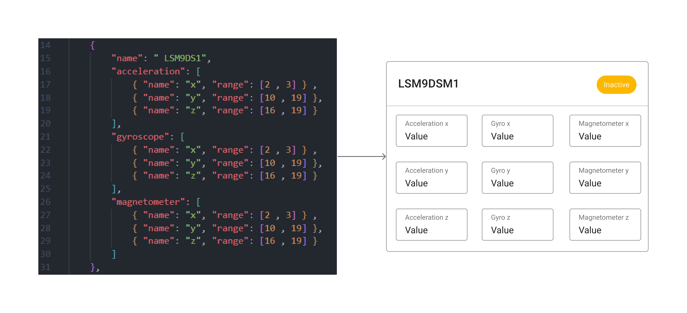

# Client Documentation

## Design Patterns

- Uses a MCV architecture.
- Component based design.

### Dynamic UI
When designing Ground Support, much consideration was put towards the longevity and adaptability of the application. Not every rocket is guaranteed to use the same hardware and components. Hardcoding the software to match the needs of the rocket year to year introduces unnecessary work, increases the risk of errors and lessens any incentive to use the application. To avoid this, we designed the application to have a dynamic UI. This is most present in the module configuration. Modules require a DataConfig that the user creates and the UI dynamically updates to reflect the structure of the DataConfig. As a result, less updates to the code are needed, the application accommodates a wide variety of hardware, the modules are easily configurable and its ease of use lessens the barrier of entry for any new users.

<p align="center">
    
</p>
A DataConfig is a JSON file that is used to interface with the app and communicate different configurations for different rockets. This file will generate what the modules will look like in the app. Telemetry data coming into the app must have exactly the same fields as specified on the data config.

## MUI

Material User Interface (MUI) is a react component library that builds off of the material design standard regulated by Google. All our styling is made in accordance with these standards. To make sure we follow these standards we will be refraining from creating our own styles as much as possible. This lessing the amount of work on our developers and generally following a proven styling standard.

When developing the frontend it is a good idea to have the MUI docs open [mui docs](https://mui.com/material-ui/getting-started/overview/)

You can import any component through `import ComponentName from "'@mui/material/{ComponentName}"` make sure to read all the props and seeing how you can customize them before altering there style.

### TypeScript

TODO: After MVP

refer to there docs there pretty good

### Styling

Only style when necessary component library should handle most of it.


Global Theming is done in `src/theme.tsx`. This is provided by MUI and allows us to change the theme of the app. This is where we will be changing the color scheme of the app. The theme is then passed down to the `ThemeProvider` which is a wrapper around the app. This allows us to use the theme in any component. To use the theme in a component you can use the `useTheme` hook. This will give you access to the theme object. You can then use the theme object to style your component. For more information on how to use the theme object refer to the [MUI docs](https://mui.com/customization/theming/)

## State Management

State management is done through the `useContext` hook. This hook allows us to create a global state that can be accessed by any component. This is done by creating a context object and wrapping the app in a `Provider` component. This allows us to pass down the state to any component. To access the state in a component you can use the `useContext` hook. This will give you access to the state object. You can then use the state object to access the state. For more information on how to use the state object refer to the [useContext](https://reactjs.org/docs/hooks-reference.html#usecontext). For our Project specifically we have two contexts `activeMission` and `SocketContext`, which are used to store the data for active views and the socket connection to the telemetry backend respectively.

### Active Mission

The active mission context is defined using a typescript interface which is as follows:

```ts
interface IActiveMissionContext {
    activeMission: IMission;
    activeMissionDispatch: React.Dispatch<{type: string, payload: any}>;
    rocket: IRocketPopulated;
    rocketDispatch: React.Dispatch<{type: string, payload: any}>;
    logs: string[];
    logsDispatch: React.Dispatch<{type: string, payload: any}>;
}
```

the state inside of the context is managed by reducer functions which are defined in `src/utils/activeMissionContext.tsx`. These reducer functions are used to update the state of active mission, current rocket, and the logs. The reducer functions are called by dispatch functions, these dispatchers are used to call the reducer functions and update the state. The dispatchers are then passed down to the components that need them through the context provider. The components can then use the dispatchers to update the state. This state can be accessed in the children of `active-mission.tsx` by using the `useActiveMission` hook. This hook will return the state object which can then be used to access the state. This is defined as follows:

```tsx
export const useActiveMission = () => useContext<IActiveMissionContext>(ActiveContext);
```

### Socket Context

The socket context is defined using a typescript interface which is as follows:

```ts
export interface SocketContext {
	logs: string[];
	aprsPacket: string | null;
	loRaPacket: string | null;
	setAprsFrequency: (frequency: number) => void;
	setLoRaFrequency: (frequency: number) => void;
}
```

This context updates its state through the socket gateway hence why there is no dispatchers or reducers. The client side of the gateway is wrapped in a `useEffect` hook which is used to connect to the socket. This hook is called when the component is mounted and disconnected when the component is unmounted. This is defined as follows:

```tsx
useEffect(() => {
		console.log('connecting');
		const socket = io('http://localhost:8086/data2');

		socket.on('loRa_packet', (packet: string) => {
			setLoRaPacket(packet);
		});

		socket.on('aprs_packet', (packet: string) => {
			setAprsPacket(packet);
		});

		socket.on('logs', (data: any) => {
			setLogs((prev) => [...prev, JSON.stringify(data)]);
		});

		return () => {
			socket.disconnect();
		};
	}, []);
```

The state can be accessed anywhere in the app by using the `useSocketContext` hook. This hook will return the state object which can then be used to access the state. This is defined as follows:

```tsx
export const useSocketContext = () => useContext<SocketContext>(Context);;
```

## Views

View are defined by the content inside of full view port. A view is meant to be modular they should only contain code for layout, state and structure while components fill up the content. The file name is the same name as the component in the definition but is under kebab-case, which is the general convention for HTML files.

## Components

Components are independent and reusable bits of code. They serve the same purpose as JavaScript functions, but work in isolation and return HTML. Components will be built as functional components as it is the status quo for most modern React applications. Components will be defined in the `components` folder. The file name is defined using PascalCase, which is the general convention for Txs component files.

### Component Life Cycle

For a react component there are three main phases:

- Mounting
- Updating
- Unmounting

Similar to OOP these we must maintain these three states to make sure our components work properly and don't slow down our app or cause unwanted side effects.

Since we are using Functional components we will use React Hooks to deal with these different phases. Below you can see the different built in methods used in a react components life cycle.

<p align="center">
    
</p>

`Mounting phase` -  New component is created and inserted into the DOM.

`Updating phase` - Rerenders compute when new state is updated.

`Unmounting` - Component is removed from the DOM.

for more in-depth information on the life cycle you can read
[Life cylce methos and hooks explained](https://retool.com/blog/the-react-lifecycle-methods-and-hooks-explained/#:~:text=A%20React%20component%20undergoes%20three%20phases%20in%20its%20lifecycle%3A%20mounting,often%20called%20%E2%80%9Cinitial%20render.%E2%80%9D)

