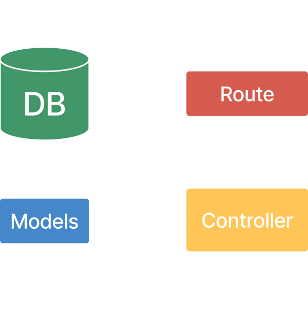

# Developer Guide

## Installation

Please see the [installation guide](installation.md#developer-installation) for a guide on how to install the project.
## Resources
- [Git Tutorial](https://www.figma.com/proto/LAxam3HVit5yoHmCxu2xa2/Git?page-id=0%3A1&type=design&node-id=1-796&viewport=554%2C653%2C0.24&t=YB0SXZsT8TWyvT93-1&scaling=min-zoom&starting-point-node-id=1%3A19&mode=design) - UVic Rocketry Git reference guide
- [Software Process](https://docs.google.com/presentation/d/1gkJjfWnc6jsr0PQ29cYPVdIOYFZum4SubFt4X8ovL-o/edit#slide=id.g146cc2337ed_0_4) - UVic Rocketry Software Process guidelines
- [Ground Support](https://www.figma.com/proto/FmNk8xeKIUDAEmA377DV3l/Rocketry-Software?page-id=0%3A1&type=design&node-id=2085-5509&viewport=-1610%2C-611%2C0.11&t=cZkbvCD7xCJrTlDc-1&scaling=min-zoom&starting-point-node-id=2085%3A5509&show-proto-sidebar=1&mode=design) - Presentation on high level overview
## Standards

### Code Style

`⚠️ 4 tab indentation ⚠️` Please change your IDE setting to match or I will hunt you down.

#### Naming Typescript
- Use `PascalCase` for component file names 
- Use `kebab-case` for view file names
- Use `camelCase` for all variable names
- Use `PascalCase` for all interface names
- Use `UPPER_CASE` for all constants

#### Naming Python
- Use `snake_case` for all variable names
- Use `PascalCase` for all class names
- Use `UPPER_CASE` for all constants

#### Comments
Use minimal commenting. If you need to comment your code either your code is too complex or is not readable. Comment is only needed for complex algorithms or for code that is not self explanatory. 

- Use `//` for single line comments and `/* */` for multi line comments.

#### Imports

- Use `import React from 'react'` for importing React
- Use `import { useState } from 'react'` for importing hooks
- Use `import { IProps } from './component'` for importing interfaces
- Use `import { useSocketContext } from '../context/socket'` for importing custom hooks

#### Typescript Interfaces
All interface names should be `PascalCase` with an `I` at the start of the name. For example `IProps` or `IUser`.

#### Github

- Use `kebab-case` for all branch names

Pull requests should have a title that is descriptive of the changes made. The description should be a list of changes made and a brief explanation of why the changes were made.

## Frontend Development


### How to Make a Component
Create a new file in the `components` folder with the name of the component in PascalCase. The file is named in `PascalCase` and the extension should be `.tsx` as we are using TypeScript. Use the following template to create a component:

```tsx
import React, { useEffect } from 'react';

interface IProps {
  // props
}

const Component: React.FC<IProps> = (props: IProps) => {
    // state
    const [data, setData] = useState<any>(null);
    // or 
    const useSocketContext = () => useContext<SocketContext>(Context);

    // effects
    useEffect(() => {
        // Perform any initializations or side effects here
        // This will only run once when the component is mounted
        return () => {
            // Perform any cleanup here
            // This will only run once when the component is unmounted
        };

    }, []);

    // render
    return (
        <>
        
        </>
    );
};

export default Component;
```
There should be an accompanying documentation file in the `documentation/components` folder with the same name as the component. This file should contain a description of the component and how to use it. Use this template: [Example Component Document](./components/exampleComponentDocumentation.md).

Once your component is finished add it to the `index.d.ts` file in the `components` folder. This will allow you to import the component from the `components` folder without having to specify the file name. For example:

```tsx
import { ExampleComponent, IExampleProps } from '../components';
```
rather than 
```tsx
import { ExampleComponent } from '../components/exampleComponent';
```


### How to Make a View

Create a new file in the `views` folder with the name of the view in kebab-case. The file is named in `kebab-case` and the extension should be `.tsx` as we are using TypeScript. Use the following template to create a view:

```tsx
import React, { useEffect } from 'react';
import { Grid } from '@material-ui/core';
import { Header } from '../../components';

interface IProps {
  // props
}

const View: React.FC<IProps> = (props: IProps) => {
    const { } = props;
    // state
    const [data, setData] = useState<any>(null);
    // or 
    const useSocketContext = () => useContext<SocketContext>(Context);

    // render
    return (
        
        <Grid 
			container 
			direction="column" 
			paddingX="2rem" 
			paddingY="2rem" 
			gap={3}
		>
			<Grid container>
				<Header breadCrumbs={breadCrumbs} />
			</Grid>
			<Grid item>
                // View content goes here
            </Grid>
        </Grid>
    );
};
```

### How to access the API Frontend

The helper file api.ts is give typesafety and security to ground supports api from the frontend. The file is located in `src/services/api.ts`. To learn more about the API please see the [API Documentation](./api.md).

```tsx
// Import the entity + verb you specifically want to access
import { ... } from "../utils/api.ts";
// If you GETTing a value from the api you also most likely need the populated version of the entity
import { ...Populated } from "../utils/api.ts";
```

`Example`
getting a rocket from the API updating a value in the rocket and then sending it back to the API.

```tsx
import { IRocketPopulated } from "../utils/";
import { getRocket, updateRocket } from "../services/api.ts";
import { useState, useEffect } from "react";

const [rocketData, setRocketData] = useState<IRocketPopulated | null>(null);

async retrieveRocket = () => {
    const rocketResponse = await getRocket(1);
    const rocketData = rocketResponse.data as IRocketPopulated;
    return rocketData;
}

// Retrieve the rocket data called when the component is mounted
useEffect(() => {
    const rocketData = await retrieveRocket();
    setRocketData(rocketData);
}, []);

// Update the rocket data
setRocketData({
    ...rocketData,
    name: "New Rocket Name"
});

const success = await updateRocket(1, rocketData).error.status === 200;
```


### How to access context

We have two contexts that are currently being used. The first is the `SocketContext` which is used to access the socket. The second is the `activeMissionContext` which is used to access the rocket and mission data of an active flight. To access the context use the following template:

```tsx

```
### How to access the Socket

## Server Backend 

For the server there are three main things that need to be created. The first is an **entity** which is the object that is stored in the database. The second is a **controller** which is the logic that is used to interact with the entity. The third is a **route** which is the endpoint that is used to access the controller.

<p align="center">
    
</p>

### How to create an Entity
```tsx
import mongoose, { Document, Schema, Types } from "mongoose";

export interface IEntity {
    // entity properties
    Name: string;
};

export interface IEntityModel extends IEntity, Document { };

export const EntitySchema = new Schema(
    {
        // entity properties
        Name: { 
            type: String, 
            required: true,
            validator: (value: string) => {
                // validation logic
            }
        },
    },
    {
        versionKey: false,
        timestamps: true
    }
);

export const Entity = mongoose.model<IEntityModel>("Entity", EntitySchema);
```

### How to create a Controller
For basic CRUD operations we will just be using the Generic controller. This controller is located in `src/controllers/Generic.ts`.
### How to create a Route
```tsx
import express from "express";
import controller from "../controllers/Generic";
import Entity from "../models/Entity";

const router = express.Router();

router.get("/", controller.getAll(Entity));
router.get("/:id", controller.getById(Entity));
router.post("/", controller.create(Entity));
router.patch("/:id", controller.update(Entity));
router.delete("/:id", controller.remove(Entity));

export default router;
```

## Telemetry Backend
