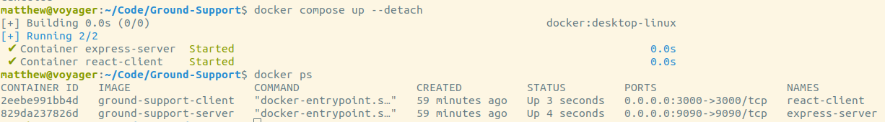

# Developer Guide

## Installation

Please see the [installation guide](installation.md#developer-installation) for a guide on how to install the project.
## Resources
- [Git Tutorial](https://www.figma.com/proto/LAxam3HVit5yoHmCxu2xa2/Git?page-id=0%3A1&type=design&node-id=1-796&viewport=554%2C653%2C0.24&t=YB0SXZsT8TWyvT93-1&scaling=min-zoom&starting-point-node-id=1%3A19&mode=design) - UVic Rocketry Git reference guide
- [Software Process](https://docs.google.com/presentation/d/1gkJjfWnc6jsr0PQ29cYPVdIOYFZum4SubFt4X8ovL-o/edit#slide=id.g146cc2337ed_0_4) - UVic Rocketry Software Process guidelines

## Docker

With the Docker engine running, start the Ground Support containers by running the following command in your terminal: 

``` bash
$ docker compose up
```

You will see the logs from the containers. To shut the containers down, hit `ctl-C` in the terminal.

To start the containers in detached (background) mode, which will hide the container logs, add the `--detach` flag to the command above. If the containers are running in detached mode, you can stop them with the following command:

``` bash
$ docker stop <container-name>
```

Where `container-name` can be found by running `docker ps`.

See the screenshot below for an example of starting the containers in detached mode, and inspecting the names of the the containers. In this screenshot, `react-client` is a container name.

<p align="center">
    
</p>

To attach a terminal (`ash`) to a running container, use the following command:
``` bash
$ docker exec -it <container-name> ash
```

See the Docker CLI and Compose CLI [documentation here](https://docs.docker.com/reference/) for more information.

### Docker Compose Profiles

There is a `dev-tools` Docker compose profile that can be run in addition to the default (unspecified) option. This profile builds a [mongo-express](https://github.com/mongo-express/mongo-express) container for inspecting and modifying the local mongo database instance. To run docker compose with this profile, enter the following in your terminal:

``` bash
$ docker compose --profile dev-tools up
```

Once running, to access the mongo-express client, visit `localhost:8081` in your browser.

## Standards

### Code Style

`⚠️ 4 tab indentation ⚠️` Please change your IDE setting to match or I will hunt you down.

#### Naming Typescript
- Use `PascalCase` for component file names 
- Use `kebab-case` for view file names
- Use `camelCase` for all variable names
- Use `PascalCase` for all interface names
- Use `UPPER_CASE` for all constants

#### Naming Python
- Use `snake_case` for all variable names
- Use `PascalCase` for all class names
- Use `UPPER_CASE` for all constants

#### Comments
Use minimal commenting. If you need to comment your code either your code is too complex or is not readable. Comment is only needed for complex algorithms or for code that is not self explanatory. 

- Use `//` for single line comments and `/* */` for multi line comments.

#### Imports

- Use `import React from 'react'` for importing React
- Use `import { useState } from 'react'` for importing hooks
- Use `import { IProps } from './component'` for importing interfaces
- Use `import { useSocketContext } from '../context/socket'` for importing custom hooks

#### Typescript Interfaces
All interface names should be `PascalCase` with an `I` at the start of the name. For example `IProps` or `IUser`.

#### Github

- Use `kebab-case` for all branch names

Pull requests should have a title that is descriptive of the changes made. The description should be a list of changes made and a brief explanation of why the changes were made.

## Frontend Development


### How to Make a Component
Create a new file in the `components` folder with the name of the component in PascalCase. The file is named in `PascalCase` and the extension should be `.tsx` as we are using TypeScript. Use the following template to create a component:

```tsx
import React, { useEffect } from 'react';

interface IProps {
  // props
}

const Component: React.FC<IProps> = (props: IProps) => {
    // state
    const [data, setData] = useState<any>(null);
    // or 
    const useSocketContext = () => useContext<SocketContext>(Context);

    // effects
    useEffect(() => {
        // Perform any initializations or side effects here
        // This will only run once when the component is mounted
        return () => {
            // Perform any cleanup here
            // This will only run once when the component is unmounted
        };

    }, []);

    // render
    return (
        <>
        
        </>
    );
};

export default Component;
```
There should be an accompanying documentation file in the `documentation/components` folder with the same name as the component. This file should contain a description of the component and how to use it. Use this template: [Example Component Document](./components/exampleComponentDocumentation.md).
### How to Make a View

### How to access the API


## Server Backend 

### How to create an Entity
```tsx

```

## Telemetry Backend


The Telemetry Backend implementation runs a socket server as well as a receiving and decoding thread. The decoding thread receives incoming encoded data from the rtl-sdr and decodes and packages it. Once data has been processed, the socket server will send data over sockets to the front end. Front end can also send a message to the socket server to prompt it to change receiving settings. This could include a change in encoding type (APRS, LORA) or other changes such as frequency. Socket sever will cause receiving thread to change its settings and run as usual.
