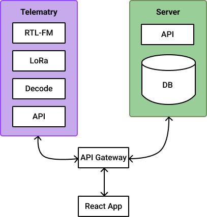

# Server Documentation

## Architecture

**Considerations** 

- System must be able to function offline
- Real time system, must be able to get data from telemetry to UI quickly 
- Two separate but related backends (telemetry and server)

Based on the considerations above the backend is to containerized into two services, one for telemetry and one for the server. These services are `Mirco services` that can communicate with one another and a single database (read more about the structure the microservices below). 

To make sure the real time aspect 

To deal with the offline aspect of the system, a local database is initialized and spun up on startup. The User can choose to connect to the local or the remote database. The main reason for the feature is to make sure when at competition we can store our data and sync up later once we connect to the remote database. Syncing of the database is accomplished whenever the user selects remote from the UI. The syncing process will add any new completed missions to the mission catalog by comparing the contents of the two databases. 


## Hosting

The application is hosting in docker containers using MongoDB atlas on a AWS service under the free tier. 

## Design Patterns

A design pattern is a general repeatable solution to a commonly occurring problem in software design. This project makes use of a couple very popular design patterns which are described below.

### Micro Service Architecture

A micro service architecture containerizes loosely coupled services (chunks of code) and defines a way for them to communicate between each other through protocols. In our case we have two services: Server and Telemetry. These services can communicate with each other through a gateway. In our case this is an API gateway.

[DEPRECATED IMAGE]
<p align="center">

</p>

### Entity Based Design

Mongoose is a wrapper framework for mongoDB that allows you to use mongoDB actions in JS. This framework creates entity which have two major parts, the schema and model. The schema dictates the interface for the for the entity similar to attributes in a structure. While the model defines how the schema will be converted into a document in the mongoDB database.

Each entity has its own schema file within the server-service/src/schema folder. In these files we define attributes and methods of the entity, similar to objects in OOP. Attributes are defined  with in a structure formate and need a type, validator and default value at the minimum. A default can either be a function ex: `() => Date.now()`(creates a timestamp at the current time) or a value. Validators are logic that determines if the value provided is correct or not. 

`Note` Validators are only run on create and save methods

```js
new mongoose.Schema({ 
    Attribute: { 
        type: String, 
        required: false,
        immutable: false,
        validator: {
            validator: v => v === x, 
            message: props => `${props.value} is not valid b/c`

        },
        default: () => 0
    }
});
```
`Convention`  All _Attributes_ in a schema are in Pascal Case (capital Fist letter)

```js
export const EntityName = mongoose.model("entity", entitySchema);
```
`Convention`  All _Entities_ are in Pascal Case (capital Fist letter)

⚠️ When calling entities only use `Entity.findById().save()` so the validator will run on it. 

**Updating Entities**

## Server Backend

Entity's from the database are updated to the database through mongoose queries, the private API or the public API. The preferred method for private (in app) communication between the server and is ...

## Telemetry

The Telemetry Service is an iteration of UVic Rocketry's [groundstation](https://github.com/UVicRocketry/groundstation) proof of concept. Based on a deep dive into the 

### Decoding 

To be filled in by the person who takes on

### Receiving

To be filled in by the person who takes on 
