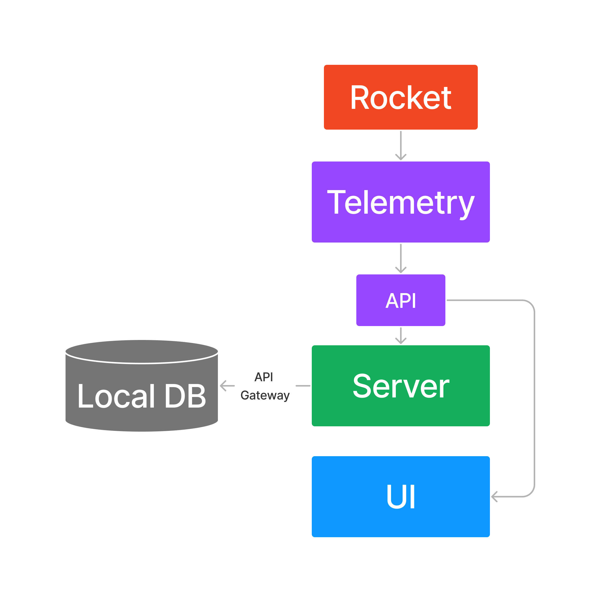
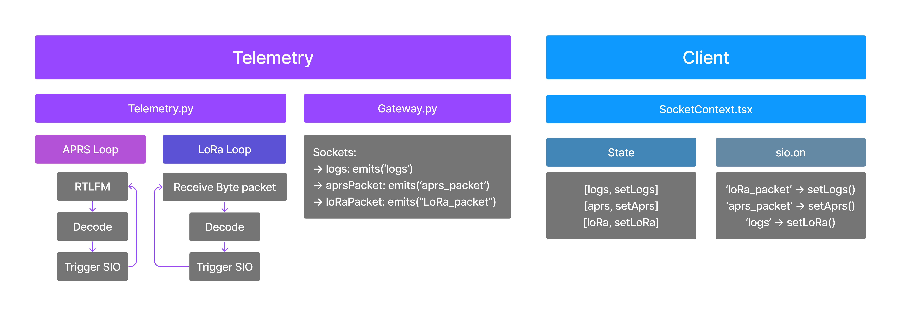

# Backend Documentation

# Architecture

**Considerations**

-   System must be able to function offline
-   Real time system, must be able to get data from telemetry to UI quickly
-   Two separate but related backends (telemetry and server)

The general flow for the system goes as follows below

<p align="center">

</p>

Based on the considerations above the backend is to containerized into two services, one for telemetry and one for the
server. These services are `Micro services` that can communicate with one another and a single database. To make sure
the real time aspect the telemetry system pipes its data directly into the UI. Simultaneously the the telemetry data is
sent to the server and saved to the local database. All live mission save to a local database unless manually
overwritten in the UI.

To deal with the offline aspect of the system, a local database is initialized and spun up on app initialization. The
User can choose to connect to the local or the remote database. The main reason for the feature is to make sure when at
competition we can store our data and sync up later once we connect to the remote database. Syncing of the database is
accomplished whenever the user selects remote from the UI. The syncing process will add any new published missions to
the mission catalog by comparing the contents of the two databases. When syncing the user is prompted weather they want
to upload certain missions. This is to make sure only good data is uploaded to the production server.

## Hosting

The application is hosting in docker containers using MongoDB atlas on a AWS service under the free tier.

## Design Patterns

A design pattern is a general repeatable solution to a commonly occurring problem in software design. This project makes
use of a couple very popular design patterns which are described below.

### Micro Service Architecture

A micro service architecture containerizes loosely coupled services (chunks of code) and defines a way for them to
communicate between each other through protocols. In our case we have two services: Server and Telemetry. These services
can communicate with each other through a gateway. In our case this is an API gateway.

<p align="center">

</p>

### Entity Based Design

Mongoose is a wrapper framework for mongoDB that allows you to use mongoDB actions in JS. This framework creates entity
which have two major parts, the schema and model. The schema dictates the interface for the for the entity similar to
attributes in a structure. While the model defines how the schema will be converted into a document in the mongoDB
database.

Each entity has its own schema file within the server-service/src/schema folder. In these files we define attributes and
methods of the entity, similar to objects in OOP. Attributes are defined with in a structure formate and need a type,
validator and default value at the minimum. A default can either be a function ex: `() => Date.now()`(creates a
timestamp at the current time) or a value. Validators are logic that determines if the value provided is correct or not.

`Note` Validators are only run on create and save methods

```js
new mongoose.Schema({
	Attribute: {
		type: String,
		required: false,
		immutable: false,
		validator: {
			validator: (v) => v === x,
			message: (props) => `${props.value} is not valid b/c`
		},
		default: () => 0
	}
});
```

`Convention` All _Attributes_ in a schema are in Pascal Case (capital Fist letter)

```js
export const EntityName = mongoose.model('entity', entitySchema);
```

`Convention` All _Entities_ are in Pascal Case (capital Fist letter)

⚠️ When calling entities only use `Entity.findById().save()` so the validator will run on it.

### Real Time Operation
A key feature of the application is showing real time data during flight. In order to do this we use sockets. A socket is an interface that allows two processes to communicate with each other over a network. This protocol follows a client-server model, where one program acts as the client that initiates the communication, and the other program acts as the server that listens for incoming connections and responds to client requests. In this case the client receives telemetry packets after they have been decoded. 

<p align="center">

</p>

# Server Backend

Entity's from the database are updated to the database through mongoose queries, the private API or the public API. The
preferred method for private (in app) communication between the server and is ...

## Entities

The Core entities relationship are as follows. Each entity has a corresponding document in the Database. Some documents
are nested as sub documents and might not populate there collection.

<p align="center">

</p>
Each entity has its own schema file, in which we define attributes and methods of the entity, similar to objects in Object Oriented Programming. Each entity has a corresponding document in the Database. Each entity has its own CRUD (Create Read Update Delete) api endpoints which allows external users to interface with the database collections. This structure has the `Rocket` Entity at the top of the hierarchy where all other entities an childeren and
grandchildern of it. The two main entities off of Rocket entity is the `Component` and `Mission`.

### Rocket

`Attributes`

| Attribute  | Required | Type        | Details                                                  |
| ---------- | -------- | ----------- | -------------------------------------------------------- |
| Name       | ✅       | string      | Name of the Rocket                                       |
| Mass       | ✅       | number      | Dry Mass of the Rocket                                   |
| Class      | ✅       | string      | Apogee class                                             |
| Motor Type | ✅       | string      | Specific weather the motor is a liquid, hybrid, or solid |
| Motor      |          | string      | Name of the motor used                                   |
| Missions   |          | [documents] | List of missions used this rocket has done               |
| Components |          | [documents] | Individual payloads of the rocket                        |

`Description`

The Rocket entity stores all the important details of the rocket and stores references to the missions and components.

`API ✅`

### Components

`Attributes`

| Attributes       | Required | Type     | Details                                            |
| ---------------- | -------- | -------- | -------------------------------------------------- |
| Name             | ✅       | string   | Name of Mission                                    |
| DataConfigId       | ✅       | document | Configuration of this payload                      |
| Telemetry Source |          | enum     | Currently only supported sources are APRS and LoRa |
| Details          | ✅       | string   | description of the payload and its purpose         |

`Description`

The Component entity allows the rocket to be compartmentalized into smaller pieces. Due to the experimental structure of UVRs rockets, there may be different payloads with unique modules. For example: a flight computer with a sensor bay and a deployable payload may have different telemetry systems and modules, therefore they will be stored and structured differently in the application.

`API ✅`

### Mission

`Attributes`

| Attributes      | Required | Type        | Details                                                                     |
| --------------- | -------- | ----------- | --------------------------------------------------------------------------- |
| Name            | ✅       | string      | Name of the mission                                                         |
| Coordinate      | ✅       | document    | Longitude and Latitude of Launch location                                   |
| IsTest          | ✅       | boolean     | Weather the mission is used for test purposes or an actual mission          |
| Date            | ✅       | string      | Date of the mission                                                         |
| Publish         |          | boolean     | Publish flags that this mission is good to be pushed to production database |
| Launch Altitude | ✅       | number      | Altitude in meters                                                          |
| Components      | ✅       | [documents] | Which components to be used in this mission. Need at least one component    |
| Data            |          | [document]  | list of field data entities                                                 |

`Description`

The mission entity contains information relevant to a launch and or test of the rocket. Missions only exist as a child of a rocket, they cannot exist on their own. The Components attribute configures which components from the rocket are active and will be recorded for that mission.

`API ✅`

### Data Config

`Attributes`

| Attributes | Required | Type        | Details                                                              |
| ---------- | -------- | ----------- | -------------------------------------------------------------------- |
| Modules    | ✅       | [documents] | List of Modules. Break down of specific components in the dataConfig |

`Description`

This document is a made up of sub documents. Structure is below. You can learn more about dataConfigs in
[Dataconfig.md](/documentation/data-config.md)

<p align="center">

</p>

`API ✅`

### Modules

`Attributes`

| Attributes   | Required | Type      | Details               |
| ------------ | -------- | --------- | --------------------- |
| Name         | ✅       | string    | name of module        |
| Field Groups | ✅       | documents | List of module groups |

`Description`

The Module entity is used to break up group fields that come from one source. For example: if you have a sensor that can read multiple values, you would create a module for that component.

`API ❌`

### Groups Fields

`Attributes`

| Attributes | Required | Type        | Details          |
| ---------- | -------- | ----------- | ---------------- |
| Name       | ✅       | string      | Field Group Name |
| Fields     | ✅       | [documents] | List of fields   |

`Description`

The Field Groups entity is used to group fields that have multiple readings, such as a sensor reading that can have 3 axes of data. 

`API ❌`

### Fields

`Attributes`

| Attributes   | Required | Type     | Details                                                           |
| ------------ | -------- | -------- | ----------------------------------------------------------------- |
| Field Name   | ✅       | string   | Field Name                                                        |
| Units        |          | string   | Units of the measured field                                       |
| Telemetry Id | ✅       | BinData  | 8 bit identification to map raw telemetry data to server entities |
| Range        | ✅       | [number] | The maximum and minimum expectable values                         |

`Description`

The Field entity is the lowest object in the data config hierarchy. These entities are used to define the information for a single data type (data point).

`API ❌`

### Field Data

`Attributes`

| Attributes            | Required | Type       | Details                                                           |
| --------------------- | -------- | ---------- | ----------------------------------------------------------------- |
| Parent Module Id      | ✅       | Id         | inherited from parent module                                      |
| Parent Field Group Id | ✅       | Id         | Inherited from field group module                                 |
| Field Name            | ✅       | string     | Name field. Inherited from the dataConfig counter part            |
| TelemetryId           | ✅       | BinData    | 8 bit identification to map raw telemetry data to server entities |
| Units                 | ✅       | String     | Units of the measured data value                                  |
| Data                  | ✅       | [document] | List of Data points                                               |

`Description`

A field data entity uses fields as a constructor for the type. All of these attributes except for data are inherited from sub documents of data config. These attributes are only created by the data constructor function on mission creation.

`API ❌`

### Data Point

`Attributes`

| Attributes | Required | Type       | Details                 |
| ---------- | -------- | ---------- | ----------------------- |
| Value      | ✅       | Decimal128 | Data point value        |
| Timestamp  | ✅       | Date       | Timestamp since turn on |

`Description`

This allows for time stamps on data.

`API ❌`

## Data Constructor

After a mission is created the structure for the data is also created. This structure is composed of an array of
dataConfig like models. The data constructor uses DataConfig as a prototype to generate the structure for how the data
is stored.

This process is ran when ever a new mission is created. The process works by calling all dataConfigs configured to the
mission calling the configured mission .

<p align="center">

</p>
